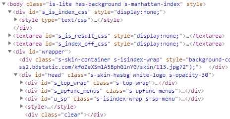
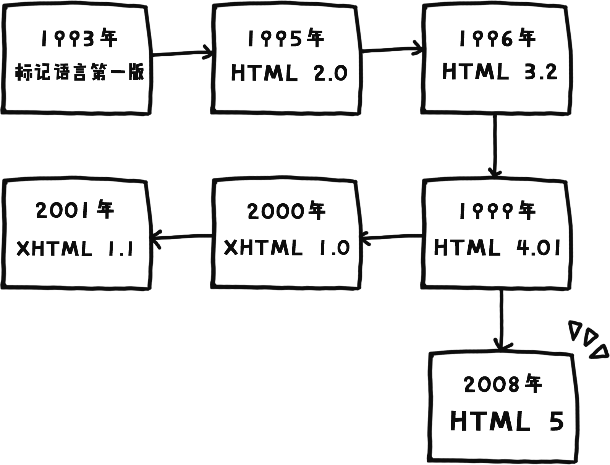
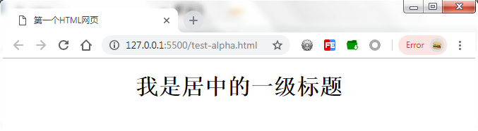

<h1 align="center">一、初识HTML</h1>

## 1.1 什么是HTML？

**HTML(HyperText Markup Language)，超文本标记语言。是一种文本类，解释执行的语言。它是Internet（互联网）上用于编写网页的主要语言。**

### 超文本（HyperText）

我们常看到的网页上面的功能，并不只有文字信息，还有多媒体信息（音频与视频）。再来，在上面提到了html是一种文本类语言，换句话说，**我们看到的多媒体信息是通过一些文本来实现的，远远超过了文本自身的功能，故称为“超文本”**。

### 标记语言（Markup Language）

我们可以看看一些知名网站的首页源代码（可以通过网页点击鼠标右键 - 检查来查看，这里推荐谷歌浏览器，后面会有所提及），不难发现是**一个个类似"\<xxx>\</xxx>"组成的，这些我们习惯称为标记、标签，或是元素，故称“标记语言”**。

<small>图1-1 百度主页部分源代码</small>

<b>我们再来通过一组网页图片来了解HTML能做什么：</b>

<small>图1-2 bing搜索主页</small>

<small>图1-3 某网页游戏界面</small>

这些我们经常看到的网页，包括最新的网页游戏，**HTML语言都是主要的编写语言**。不过单靠HTML可能并不会很美观，需要配合CSS（层叠样式表，本课程后期会提及）和JavaScript特效才能完成一个酷炫的网页，三者缺一不可。

**我们称HTML、CSS、JavaScript为“网页三剑客”。**

## 1.2 HTML发展历史

<b>关于HTML发展历史我们可以看看下面的手绘图：</b>

<small>图1-4 HTML发展历史手绘图</small>

**目前在使用的标准有HTML 4.01、HTML 5、XHTML 1.0与XHTML 1.1。**XHTML是HTML的扩展版，因为HTML语言本身有一些缺陷（比如标签比较单一），所以W3C（万维网联盟）颁布了XHTML标准希望能弥补HTML的不足。但由于现有网页几乎都是HTML编写的，XHTML完全替代HTML并不可行。

**目前主流的网页开发标准主要是HTML 5，其次是HTML 4.01。新标准主要用于现代化的新功能，如多媒体和游戏，旧标准主要用于向下兼容。**

## 1.3 HTML 5标准

上述的HTML 5是下一代的HTML，它将会取代HTML 4.01和XHTML 1.1，成为新一代的Web语言。

### 1.3.1 HTML 5新特性

新的HTML 5标准相比旧标准，**去掉了冗余的标签与属性、语义化更加严谨、性能和集成更强大。**当然，HTML 5的新特性更主要体现在以下几点：

- 移动端的多媒体实现（audio, video, canvas）
- 离线存储（localStorage）
- 文档间的拖拽功能（全局draggable属性）

**利用HTML 5标准，就可以通过一个标签或是几行JavaScript代码实现上述功能。**

### 1.3.2 支持HTML 5的浏览器

支持HTML 5的浏览器有Chrome（谷歌浏览器）、Firefox（火狐浏览器）、Safari（苹果系统浏览器）、Opera（欧朋浏览器）、IE 9+（微软IE浏览器9版本以上）

还有多款国内的浏览器，包括360、百度、搜狗……这些浏览器基本拥有两个内核（IE + Chromium 谷歌工程版内核）。**另外，这些浏览器在我国市场占比较大，并且用户日常上网以Chromium内核为主，与Chrome效果基本一致，所以我们建议网页开发者使用Chrome谷歌浏览器进行开发。**

## 1.4 第一个HTML页面

阅读本节前，可以事先准备一个编辑器（记事本、Notepad ++）用于编写HTML。这里推荐使用Notepad++，功能更加强大，便于学习。用记事本当然也可以，不过在保存文件时注意编码要选择UTF-8。

Notepad++下载地址：<a href="https://notepad-plus-plus.org/" target="_blank">https://notepad-plus-plus.org/</a>

### 1.4.1 HTML语法核心

HTML标签基本语法如下：

	<标签名 属性名1="属性值1" 属性名2="属性值2" >显示的内容</标签名>
	<特殊标签名 属性1="值1" 属性2="值2" />
	
	例如：(一个居中显示的一级标题，id为main-title)
	<h1 align="center" id="main-title" >Hello!</h1>

	<meta charset="utf-8">

我们写标签时需要注意：

- 除了几个特殊标签（比如说上面的meta标签），几乎所有的标签都需要有起始标签与结束标签
- 标签名与属性名使用小写字母
- 所有的标点符号都是英语的符号
- 属性两边用1个空格隔开
- 属性必须写在起始标签里面
- 属性可以不止2个，也可以不写属性

### 1.4.2 HTML基本结构

<b>HTML标签内有两部分：头(head) 身体(body)</b>

- 头：配置当前html页面的信息，如：字符集编码，描述，关键字...
- 身体：放html标记的，主要的页面内容。

<b>注意不要写多个头或者多个身体！</b>

一个HTML网页基本结构如下：

	<html>
		<head>
			<title>网页标题</title>
		</head>
		<body>Hello!</body>
	</html>

我们可以打开编辑器键入以上代码，键入代码时注意缩进（head标签前面多一个Tab键缩进），并保存成"index.html"，然后双击打开运行看看。但这个结构是不符合标准的，我们还需要添加一些额外的信息。

<b>一个合格的HTML网页结构应该具备：</b>

1. 头（head）与身体（body）
2. HTML标准声明（<!DOCTYPE html>），用于告诉浏览器此HTML文件是使用什么标准的。
3. 字符集编码（charset），配置编码可以避免中文或一些语言字符乱码
4. 标题（title） 

代码如下所示：

	<!DOCTYPE html>
	<html>
	<head>
		<meta charset="UTF-8">
		<title>第一个HTML页面</title>
	</head>
	<body>
		Hello World!
	</body>
	</html>

以上代码运行效果如下图：

<small>图1-5 第一个HTML网页</small>

> 关于缩进：我们常常在被包含者的标签前加一个Tab键（键盘Q的左边）的缩进。就如head与title一样，不难发现title标签的前面是多了一段空隙的，这段空隙就是缩进。

<b>我们建议编写html时把缩进做好，这样使得代码结构变得清晰，是专业的体现。</b>

### 1.4.3 关键字与描述

有时候我们需要添加网页的相关描述，方便搜索引擎检索与分类。若有需要，则可以在head标签里面加上关键字与描述的meta配置。

	<!DOCTYPE html>
	<html>
	<head>
		<meta charset="UTF-8">
		<meta name="keywords" content="hello,world">
		<meta name="description" content="This is my first Webpage.">
		<title>第一个HTML页面</title>
	</head>
	<body>
		Hello World!
	</body>
	</html>
	

> meta标签称为元信息标记，它提供的信息是用户不可见的，一般我们会把它们放在head标签里面，用于配置页面信息，比如关键字、描述、作者、字符集等。感兴趣的读者可以参考W3School的meta标签专栏。

meta元素参考资料：<a href="http://www.w3school.com.cn/tags/tag_meta.asp">http://www.w3school.com.cn/tags/tag_meta.asp</a>

### 1.4.4 注释
作为开发者，为了方便维护，通常会在代码块上加上说明性言语，用于告诉自己或者团队成员这块代码是写的什么功能，或者这里可能会出现什么问题。那么问题来了，用户看到这些说明性言语会怎么想这个网站呢？所以就诞生了**一种只有在开发源码里面查看，而浏览器不会显示的语法——注释**。

HTML的注释语法如下：

	<!-- 注释块，说明性言语 -->
		

我们可以尝试一下：

	<!DOCTYPE html>
	<html>
	<head>
		<meta charset="UTF-8">
		<meta name="keywords" content="hello,world">
		<meta name="description" content="This is my first Webpage.">
		<title>第一个HTML页面</title>
	</head>
	<body>
		<!-- 这里写的东西不会被浏览器渲染 -->
		这句话会被浏览器渲染并显示。
	</body>
	</html>

运行效果如下图：

<small>图1-6 注释的文字不会显示</small>

## 1.5 扩展

<b>有些元素添加了一些特定属性会使元素样式发生变化。
</b>

对于初学者，以下的属性需要了解一下：

- align属性（文字对齐方式，不同的元素会不一样）
- bgcolor属性（背景色属性）
- background属性（背景图片属性）

<b>注意不是每个元素都有效果的（就比如meta标签）。</b>

### 1.5.1 标题对齐
> 在标题元素中添加align属性可以自定义标题文字对齐方式。

	<h1 align="center">我是居中的一级标题</h1>

<b>这里把代码放在body标签里面。</b>

运行效果如下图：

<small>图1-7 居中的标题</small>

### 1.5.2 网页背景
> 在body中添加bgcolor属性，可以改变网页背景颜色。

	<body bgcolor="lightblue">
		...
	</body>

**颜色可以使用单词表达（如：red 红色，blue 蓝色，pink 粉色）。另一种是十六进制的表达方式（如： #ff0000 红色， #00ff00 绿色）。关于颜色表达后面会有专门的章节详细说明，这里只需要了解bgcolor属性的用法即可。**

> 在body中添加background属性，可以改变网页背景图片（重复平铺的背景）。

	<body background="test.jpg">
		...
	</body>

运行效果如下图：

<small>图1-8 body添加背景</small>

**这里注意图片是相对路径（后面会有所提及），test.jpg与html文件是同一个目录下的，故可以直接写图片的文件名，切记要把图片后缀名加上。**

### 1.5.3 关于扩展属性注意事项

不难发现，扩展属性都可以用于改变元素样式，它能在开发阶段很方便快捷地实现效果。但如果后期要维护起来就可能要逐个逐个替换文本，这将是一个非常繁琐且浪费时间的工程。**所以这些样式方面的扩展属性，我们一般会交由CSS来处理。**

	
## 布局

### 块级元素（block）
> 默认占满一行的元素。
> 比如：

	div, h1-6, p , table , form , ul , ol , dl ...

### 行内元素（inline）
> 只要窗口足够宽，一行内可以有无数个的元素。
> 比如：

	span, b, i , u, del , sup, sub...

#### 无论是block还是inline，都可以通过CSS改变，无需太在意。

### HTML5 布局新标签
> 在H4标准里面，所有的布局容器div+id，代码会略繁琐。 
> 在H5标准内，每一部分的布局容器都有自己的标签。

	<header>	头部
	<nav>		导航栏
	<section>	内容（区块）
	<aside>		边栏
	<article>	文章
	<footer> 	脚部（版权）

> 一般body下面的标签，都建议用HTML5的标签。

	<!DOCTYPE html>
	<html lang="en">
	<head>
		<meta charset="UTF-8">
		<title>Test</title>
	</head>
	<body>
		<nav>
			<!-- 导航栏 -->
		</nav>
	
		<section>
			<!-- 内容 -->
		</section>
	</body>
	</html>