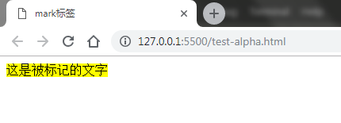
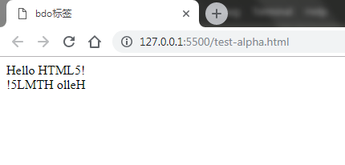
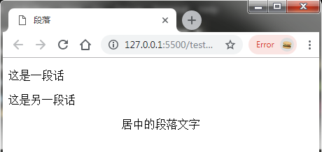
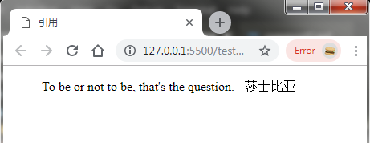
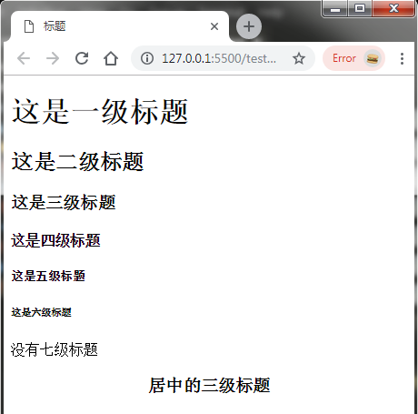
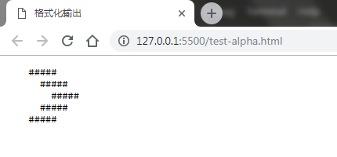
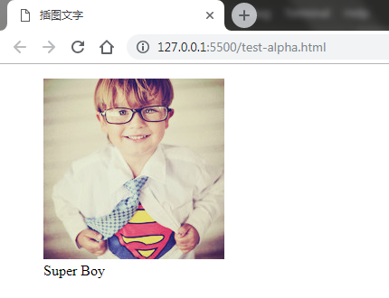
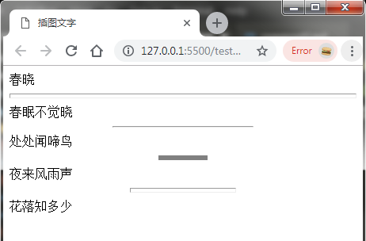

<h1 align="center">二、HTML常用元素</h1>

在上一章介绍了一个简单HTML网页是如何编写的，但一个网页是不会只有一个标题的，还需要有很多的其他元素支撑，如多媒体元素，表单（登录注册）。在这一章我们来学习一下HTML的常用元素。

## 2.1 文本元素

### 2.1.1 换行符 &lt;br/&gt;
HTML标签内，**所有单纯的空格与回车都只有1个空格生效**，如需真正的换行，必须使用换行符。

	<!-- 以下的文字不会换行，并会用1个空格代替换行 -->	
	静夜思
	李白

	<!-- 以下的文字会换行 -->
	静夜思<br/>
	李白

> &lt;br/&gt;标签是目前学习过的第二个（还有meta）不用写结束标签的元素。

### 2.1.2 文本格式化

#### 1. 加粗

在HTML中有两种加粗文字的元素，分别是&lt;b&gt;与&lt;strong&gt;标签。从代码简易度上看，用b标签会稍频繁一些。

	<b>这是粗体文字</b>
	<strong>这也是粗体文字</strong>

#### 2. 倾斜

与文字加粗一样，在HTML中有两种倾斜文字的元素，分别是&lt;i&gt;与&lt;em&gt;标签。i标签会稍用得频繁一些。

	<i>这是斜体文字</i>
	<em>这也是斜体文字</em>

#### 3. 文字下划线

在HTML中有两种添加下划线的元素，分别是&lt;u&gt;与&lt;ins&gt;标签。

	<u>这是下划线文字</u>
	<ins>这也是下划线文字</ins>

#### 4. 删除线

给文字添加&lt;s&gt;或者&lt;del&gt;标签包裹，文字上会有一条线从中部穿过，称为删除线。电商项目或更新文档经常用到这种格式的文字。

	<s>这是删除线文字</s>
	<del>这也是删除线文字</del>

#### 5. 小号字体

因为font标签在HTML5标准已经不推荐使用了，所以我们可以利用&lt;small&gt;标签缩小一号字体。一般用于免责声明和澄清声明。

	<small>这是缩小的字体</small>
	
<p class="intro">以上5种字体效果如下图：</p>

<center></center>
<center><small>图2-1 文字格式化效果图</small></center>

### 2.1.3 语义化

语义化，就是在使用标签的时候多使用有英文语义的标签，比如h标签，在HTML中就是就是用来定义标题，还有p标签，英文是paragraph段落，table表格标签，等等。比如，不能说p标签可以替代h4标题这样（虽然效果差不多）。**请注意HTML是一款语义化语言，这也是为什么加粗文字也有两个标签的原因。**

标签|语义
:-----:|:----:
b, i, u|标记一段文字，或区分周围的内容，但不是特别强调或重要。
strong, em, ins|强调一段重要的文本

### 2.1.4 上下标字
有时我们需要在网页中显示一些简单的数学算式，或者化学反应等学术性元素。实现这些功能可以利用上下标文字。

	<sup>这里是上标字</sup>
	<sub>这里是下标字</sub>

	X<sup>2</sup> + X<sup>2</sup> = 2X<sup>2</sup>
	HCl + NaOH = NaCl + H<sub>2</sub>O

<p class="intro">以上代码效果如下图：</p>

<center></center>
<center><small>图2-2 上下标文字示例</small></center>

### 2.1.5 突出显示文本

HTML提供了一种给文字添加黄色背景色（荧光笔）的元素，用于标记突出的文字。

	<mark>这是被标记的文字</mark>

<center></center>
<center><small>图2-3 标记文字</small></center>

### 2.1.6 语言辅助阅读

HTML提供了辅助阅读非西方文字的解决方案，用于辅助读者掌握表意语言文字的正确发音。比如：汉语拼音。

	<ruby style="font-size: 200%;"> 
		饕<rt>tāo</rt>
		餮<rt>tiè</rt>
	</ruby>

> 注意：这里style="font-size: 200%;"是一个css样式，表示放大字体。

<center></center>
<center><small>图2-4 “饕餮”拼音注解</small></center>

### 2.1.7 设置文本方向

HTML还提供了自定义文字输出方向的解决方案，bdo，其主要用于反转文字输出。**bdo必须使用属性dir才可以设置，一共两个值：rtl（从右到左）和ltr（从左到右）。一般默认是ltr。**

	<bdo>Hello HTML5!</bdo><br>
	<bdo dir="rtl">Hello HTML5!</bdo>

<p class="intro">以上代码效果如下图：</p>

<center></center>
<center><small>图2-5 bdo标签示例</small></center>

### 2.1.8 字符实体
> 有时候内容中需要用到大于号（>）或小于号（<），会出现以下尴尬的情况：

	<h1><h1></h1>

大于号在这里会被解析成语法，故需使用到字符实体，告诉浏览器，这是个真正的字符，而不是语法。当然，字符实体还可以用于输入一些常用的特殊符号，比如版权信息。

	<h1>&lt;h1&gt;</h1>
	<h1>&copy; 2017 - 2018</h1>
	<h1>&nbsp;&nbsp;&nbsp;&nbsp;&nbsp;（实体空格会保留）</h1>

> 注意&与;这两个符号缺一不可，请注意代码规范！

<center></center>
<center><small>图2-6 字符实体</small></center>

#### 常用的字符实体

符号|HTML实体|含义
:----:|:---------:|:----:
&gt;|```&gt;```|大于号
&lt;|```&lt;```|小于号
&amp;|```&amp;```|逻辑“与”
&copy;|```&copy;```|版权C
&reg;|```&reg;```|注册商标R
&nbsp;|```&nbsp;```|空格
&quot;|```&quot;```|双引号

## 2.2 分组元素

### 2.2.1 段落 &lt;p&gt;
段落p标签（paragraph的缩写）是最基本的分组元素。在布局上占满一行，并且增加文字上下间隙，字体方面没特别的样式。主要用于段落分隔。

	<p>这是一段话</p>
	<p>这是另一段话</p>

> p元素可以添加align属性，自定义文字对齐方式。

	<p align="center">居中的段落文字</p>
	<!-- left 居左；right 居右 -->

<center></center>
<center><small>图2-7 段落元素</small></center>

### 2.2.2 引用 &lt;blockquote&gt;

这个标签与p比较相似，主要是用于文章中的引用文字。在布局上，除了文字上下的间隙增加，还有左右方向的缩进。

	<blockquote>To be or not to be, that's the question. - 莎士比亚</blockquote>

<center></center>
<center><small>图2-8 引用元素</small></center>

### 2.2.3 标题 &lt;hX&gt; (1<=X<=6)
标题h标签（heading的缩写）有6个，分别是h1, h2, ...,h6，代表一到六级标题。注意一级标题（h1）是最大的，六级标题（h6）是最小的。在布局上，占满一行并增加文字上下间隙。样式方面，字体会加粗，并且根据标题级别缩放字体大小。
	
	<h1>这是一级标题</h1>
	<h2>这是二级标题</h2>
	<h3>这是三级标题</h3>
	<h4>这是四级标题</h4>
	<h5>这是五级标题</h5>
	<h6>这是六级标题</h6>

	<h7>没有七级标题</h7>
	<!-- 没有h7标签，但文字需要渲染，浏览器会使用默认的样式 -->

> 标题元素也可以添加align属性，自定义文字对齐方式。

	<h3 align="center">居中的三级标题</h3>
	<!-- left 居左；right 居右 -->

<center></center>
<center><small>图2-9 标题元素</small></center>

### 2.2.4 格式化输出 &lt;pre&gt;

HTML中的文本需要换行必须添加```<br>```，如果换行多了，一篇文章的结构就会乱套了。当然，HTML提供了一些解决方案，比如p标签与pre标签。pre标签可以把我们在编辑器的文字排版原封不动地输出到页面里，通常用作简单的文字排版。

> 在布局上，pre占满一行，字体样式没有变化。

	<pre>
		#####
		   #####
		    #####
		  #####
		#####
	</pre>

<center></center>
<center><small>图2-10 pre元素</small></center>

### 2.2.5 插图文字 &lt;figure&gt;

HTML提供了一种图文并茂的解决方案，可以把图片和文字介绍结合一起管理。通常figure标签里面会有一个figcaption标签，用于区分文字与图片并换行。在布局上，figure和figcaption标签都占满一行，除了段落空隙外，还有左右方向上的缩进（效果与blockquote类似）。

> 注意这里用到了``````图片标签，会在后面的“嵌入元素”里详细讲解。另外图片可以命名为test.jpg，然后放在html文件的同一目录。

	<figure>
		
		<figcaption>Super Boy</figcaption>
	</figure>

<center></center>
<center><small>图2-11 插图文字</small></center>

### 2.2.6 分隔线 &lt;hr&gt;

hr标签可以提供一条占满一行的分隔线。注意hr标签是单标签的用法，没有结束标签。分隔线的样式可以通过它特定的属性改变：

属性名|值|用法
:-----:|:---:|:----:
size|整数|分隔线的厚度（高度）
width|像素值，百分比|分隔线的宽度
align|left, center, right|分隔线的对齐方式
noshade|——|分隔线默认是立体的（有一定size后），添加该属性后会变为扁平化的线。


**注意：hr的属性只需要了解即可，W3C官方也不推荐我们用属性来改变hr的样式，而应交由CSS来处理为宜。但由于现在还存在较多保留旧技术的项目，故需了解这些技术的用法。**

	春晓
	<hr size="6">
	春眠不觉晓
	<hr width="40%">
	处处闻啼鸟
	<hr size="6" width="60px" noshade>
	夜来风雨声
	<hr size="6" width="30%" align="center">
	花落知多少

<p class="intro">效果如下图：</p>

<center></center>
<center><small>图2-12 分隔线</small></center>

### 2.2.7 无序列表

